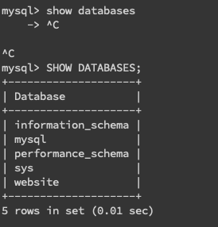

## ✏️ Task 2: Create database and table in your MySQL server

### ✍️ Create a new database named_ website
```mysql
mysql> CREATE DATABASE website;
```


###  ✍️ Create a new table named_ _member__, in the_ _website_ _database, designed as below_
```mysql
mysql> USE website;
Database changed
mysql> CREATE TABLE member (
    ->   id BIGINT AUTO_INCREMENT PRIMARY KEY,
    ->   name VARCHAR(255) NOT NULL,
    ->   username VARCHAR(255) NOT NULL,
    ->   password VARCHAR(255) NOT NULL,
    ->   follower_count INT UNSIGNED NOT NULL DEFAULT 0,
    ->   time DATETIME NOT NULL DEFAULT CURRENT_TIMESTAMP
    -> );
```


---

## ✏️ Task 3: SQL CRUD

### ✍️ Write SQL statements to complete following requests based on the database and table created in Task 2.

#### -  INSERT a new row to the member table where name, username and password must be set to test. INSERT additional 4 rows with arbitrary data.
```mysql
mysql> INSERT INTO member (name, username, password) VALUES ('test', 'test', 'test');

mysql> INSERT INTO member (name, username, password, follower_count)
    -> VALUES ('Frieren', 'white_hair_grandma', 'wow_magic', 100);
Query OK, 1 row affected (0.00 sec)

mysql> INSERT INTO member (name, username, password, follower_count)
    ->  VALUES ('Feren', 'purple_hair_girl', 'i_love_snack', 50000)
    -> ;
Query OK, 1 row affected (0.00 sec)

mysql> INSERT INTO member (name, username, password, follower_count)
    -> VALUES ('Stark', 'Ax_boi', 'i_love_feren', 1);
Query OK, 1 row affected (0.00 sec)

mysql> INSERT INTO member (name, username, password, follower_count)
    -> VALUES ('Himmel', 'legendary_warrior', 'i_love_frieren', 6000)
    -> ;
Query OK, 1 row affected (0.00 sec)
```

#### -  SELECT all rows from the member table.
```mysql
mysql> SELECT * FROM member;
```


#### -  SELECT all rows from the member table, in descending order of time.

```mysql
mysql> SELECT * FROM member ORDER BY time DESC;
```


#### -  SELECT total 3 rows, second to fourth, from the member table, in descending order of time.

```mysql
mysql> SELECT * FROM member ORDER BY time DESC LIMIT 3 OFFSET 1;

```


#### -  SELECT rows where username equals to test.

```mysql
mysql> SELECT * FROM member WHERE username = 'test';
```


#### -  SELECT rows where name includes the es keyword.

```mysql
mysql> SELECT * FROM member WHERE name LIKE '%es%';
```


#### -  SELECT rows where both username and password equal to test.
```mysql
mysql> SELECT * FROM member WHERE username = 'test' AND password = 'test';
```


#### -  UPDATE data in name column to test2 where username equals to test.

```mysql
mysql> UPDATE member SET name = 'test2' WHERE username = 'test';
```


---

## ✏️ Task 4: SQL Aggregation Functions

### Write SQL statements to complete following requests based on the database and table created in Task 2.

#### -  SELECT how many rows from the member table.
```mysql
mysql> SELECT COUNT(*) FROM member;
```

#### -  SELECT the sum of follower_count of all the rows from the member table.
```mysql
mysql> SELECT SUM(follower_count) FROM member;
```
#### -  SELECT the average of follower_count of all the rows from the member table.

```mysql
mysql> SELECT AVG(follower_count) FROM member;
```
#### -  SELECT the average of follower_count of the first 2 rows, in descending order of follower_count, from the member table.

```mysql
mysql> SELECT AVG(follower_count) FROM (
    ->     SELECT follower_count FROM member ORDER BY follower_count DESC LIMIT 2
    -> ) AS query_answer;
```


---

## ✏️ Task 5: SQL JOIN

### Complete the following requests to support a message board system.

#### -  Create a new table named_ _message__, in the_ _website_ _database. designed as below:

```mysql
mysql> CREATE TABLE message (
    ->     id BIGINT AUTO_INCREMENT PRIMARY KEY,
    ->     member_id BIGINT NOT NULL,
    ->     content VARCHAR(255) NOT NULL,
    ->     like_count INT UNSIGNED NOT NULL DEFAULT 0,
    ->     time DATETIME NOT NULL DEFAULT CURRENT_TIMESTAMP,
    ->     FOREIGN KEY (member_id) REFERENCES member(id)
    -> );
Query OK, 0 rows affected (0.02 sec)
```

這時候我先加了一筆 message 資料，並讓作者是 member_id = 2 的 Frieren
```mysql
mysql> INSERT INTO message ( member_id, content, like_count) VALUE ( 2, "Hello World", 22);
Query OK, 1 row affected (0.00 sec)
```

#### -  SELECT all messages, including sender names. We have to JOIN the member table to get that.
```mysql
mysql> SELECT message.*, member.name AS sender_name
    -> FROM message
    -> JOIN member ON message.member_id = member.id;
```


#### -  SELECT all messages, including sender names, where sender username equals to test. We have to JOIN the member table to filter and get that.


```mysql
mysql> SELECT message.*, member.name AS sender_name
    -> FROM message
    -> JOIN member ON message.member_id = member.id
    -> WHERE member.username = 'test';
Empty set (0.00 sec)
```


#### -  Use SELECT, SQL Aggregation Functions with JOIN statement, get the average like count of messages where sender username equals to test.

這時候我先加了一筆 test 的 message 資料
```mysql
mysql> INSERT INTO message ( member_id, content, like_count) VALUE ( 1, "Hello World from test", 5566);
Query OK, 1 row affected (0.00 sec)
```

再來才做 query
```mysql
mysql> SELECT AVG(message.like_count) AS avg_like_count FROM message JOIN member ON message.member_id = member.id WHERE member.username = 'test';
```


#### -  Use SELECT, SQL Aggregation Functions with JOIN statement, get the average like count of messages GROUP BY sender username.
```mysql
mysql> SELECT member.username, AVG(message.like_count) AS avg_like_count
    -> FROM message
    -> JOIN member ON message.member_id = member.id
    -> GROUP BY member.username;
```

